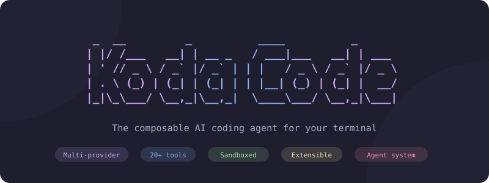

<div align="center">

<picture>
  <source media="(prefers-color-scheme: dark)" srcset="assets/logo-banner.svg">
  <source media="(prefers-color-scheme: light)" srcset="assets/logo-banner.svg">
  
</picture>

[](https://go.dev)
[](LICENSE)
[](https://github.com/sageil/kodacode/releases)
[](https://github.com/sageil/homebrew-tap)
[](https://kodacode.dev)

</div>


## Turns AI from "suggestion generator" into "work executor"

## How It Works
The built‑in `engineer` agent is designed for broad or high‑impact work.
Instead of editing immediately, it deliberately slows down to reduce risk:

- Explores the repository to understand context
- Produces a structured execution plan
- Asks for approval before making changes
- Executes work in verified steps
- Reviews results against explicit acceptance criteria
## Agents ##
- builder Default, project path sandboxed agent for development work
- advisor Read-only research and advisory agent
- [More Agents](https://kodacode.dev/features/agents/)
## Features ##

- [Sandbox by default](https://kodacode.dev/features/sandbox/)
- [Model Routing](https://kodacode.dev/features/model-routing/)
- [Semantic Code Search](https://kodacode.dev/features/search/)
- [Cost Tracking](https://kodacode.dev/features/cost-tracking/)
- [Project Memory](https://kodacode.dev/features/memory/)
- [Context Management](https://kodacode.dev/features/context/)


## Install

```bash
# Homebrew
brew tap sageil/tap && brew install --cask kodacode

# Quick install
curl -fsSL https://raw.githubusercontent.com/sageil/kodacode/main/install.sh | sh

# Go
go install github.com/sageil/kodacode/v1/cmd/kodacode@latest
```

## Quick Start

```bash
# Optional: authenticate with a provider
kodacode login openai

# Start
kodacode
```

Type your message and press Enter. KodaCode handles the rest.

## Documentation

Full documentation, configuration reference, and guides are available at **[kodacode.dev](https://kodacode.dev)**.

## Credits

See [CREDITS.md](CREDITS.md) for the full list of open source projects KodaCode is built on.

## License

[AGPL-3.0](LICENSE)
