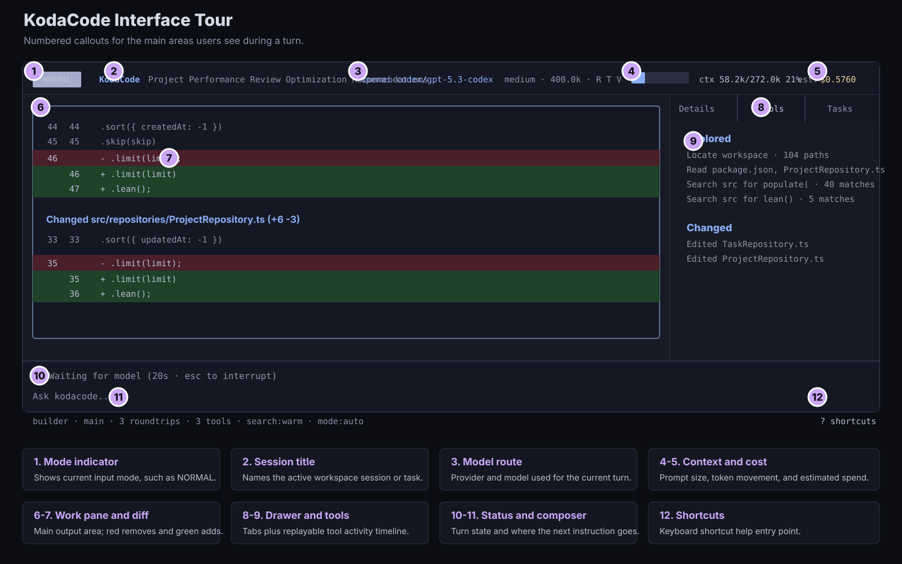

<div align="center">

<picture>
  
</picture>

[](https://go.dev)
[](LICENSE)
[](https://github.com/sageil/kodacode/releases)
[](https://github.com/sageil/homebrew-tap)
[](https://kodacode.dev)

</div>

## Turns AI from "suggestion generator" into "work executor"

## How It Works

Use builder when the task is clear and contained. Use engineer when the task is broad, risky, architectural, or needs an approved plan before edits

Goal:
Build a calculator that estimates monthly payment, total interest, and affordability range.

Acceptance criteria:

- Inputs: home price, down payment, interest rate, amortization years, property tax, insurance, condo fees, gross monthly income, monthly debts.
- Outputs: loan amount, estimated monthly principal + interest, total monthly housing cost, debt-to-income ratio, and affordability status.
- Use standard fixed-rate mortgage amortization math.
- Validate invalid inputs clearly.
- Add focused tests for payment calculation, DTI calculation, and edge cases.
- Do not use fake values or hardcoded backend state.
- Run the relevant test suite before finishing.

Before editing:

- Inspect the existing app structure.
- Propose a short implementation plan.
- Wait for approval before making code changes.

## Agents

- builder Default, project path sandboxed agent for development work
- Planner Read-only research and advisory agent
- [More Agents](https://kodacode.dev/features/agents/)

## Features

- [Sandbox by default](https://kodacode.dev/features/sandbox/)
- [Model Routing](https://kodacode.dev/features/model-routing/)
- [Built-in Tools](https://kodacode.dev/features/tools/)
- [Cost Tracking](https://kodacode.dev/features/cost-tracking/)
- [Project Memory](https://kodacode.dev/features/memory/)
- [Context Management](https://kodacode.dev/features/context/)

## Install

```bash
# Homebrew
brew tap sageil/tap && brew install --cask kodacode

# Quick install
curl -fsSL https://raw.githubusercontent.com/sageil/kodacode/main/install.sh | sh

# Quick install linux
curl -fsSL https://raw.githubusercontent.com/sageil/kodacode/main/install.sh | sh

# Go
go install github.com/sageil/kodacode/cmd/kodacode@latest
```

## Quick Start

```bash
# Optional: authenticate with a provider
kodacode login openai

# Start
kodacode
```

Configure providers with `/connect`, then choose a model route such as
`openai/gpt-5`. See the [model routing docs](https://kodacode.dev/features/model-routing/)
for provider IDs and OAuth-specific routes.

Type your message and press Enter. KodaCode handles the rest.

## Documentation

Full documentation, configuration reference, and guides are available at **[kodacode.dev](https://kodacode.dev)**.

## License

[AGPL-3.0](LICENSE)
