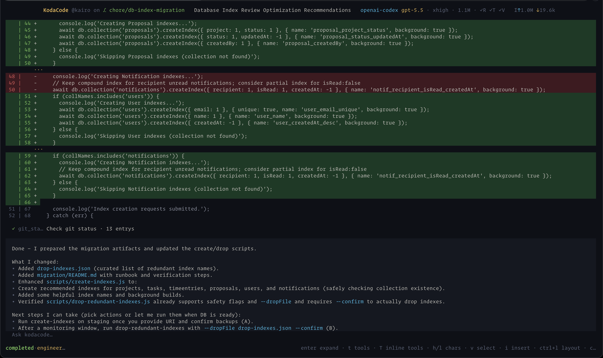
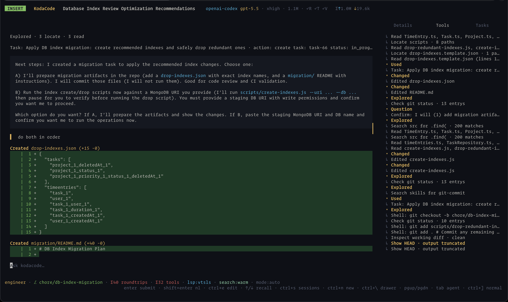

## Turns AI coding from *suggestion generator* into *work executor*
<div align="center">

[](https://go.dev)
[](LICENSE)
[](https://github.com/sageil/kodacode/releases)
[](https://github.com/sageil/homebrew-tap)
[](https://kodacode.dev)

</div>

## Layouts

KodaCode has two TUI layouts for different working styles:

- **Shell layout** is the default single-plane workflow. It keeps the transcript,
  tool activity, diffs, and final responses in one continuous terminal surface.
  It is built for keyboard-heavy use with vi-like transcript navigation,
  including `h` / `l` for character movement, `j` / `k` for tool selection,
  `v` for visual selection, and `i` to return to insert mode.
- **Classic layout** keeps a persistent right-side inspector with `Details`,
  `Tools`, and `Tasks` tabs. It is useful when you want the main transcript and
  structured tool/task state visible at the same time.

Switch layouts from the TUI with `Ctrl+L`, or set a default in
`~/.config/kodacode/config.yaml` with `tui.layout: shell` or `tui.layout: classic`.

<picture>
  
</picture>

<picture>
  
</picture>


## How It Works

Run `kodacode` inside a repository, choose a provider and model, then ask for
real work. KodaCode keeps orchestration, permissions, tool execution, and prompt
assembly in runtime code and durable events instead of hidden prompt behavior.

Use `builder` when the task is clear and contained. Use `engineer` when the task
is broad, risky, architectural, or needs an approved plan before edits.

Example prompt:

```text
Build a calculator that estimates monthly payment, total interest, and affordability range.

Acceptance criteria:

- Inputs: home price, down payment, interest rate, amortization years, property tax, insurance, condo fees, gross monthly income, monthly debts.
- Outputs: loan amount, estimated monthly principal + interest, total monthly housing cost, debt-to-income ratio, and affordability status.
- Use standard fixed-rate mortgage amortization math.
- Validate invalid inputs clearly.
- Add focused tests for payment calculation, DTI calculation, and edge cases.
- Do not use fake values or hardcoded backend state.
- Run the relevant test suite before finishing.
```

For a plan-first flow, select the `engineer` agent in the TUI and ask:

```text
Before editing, inspect the app structure, propose a short implementation plan,
and wait for approval before making code changes.
```

## Agents

- `builder`: default project-sandboxed coding agent
- `engineer`: structured planning, task tracking, and delegation
- `reviewer`: read-focused review and acceptance checks
- `planner`: read-only repository analysis and implementation planning
- [More about agents](https://kodacode.dev/features/agents/)

## Features

- [Sandbox by default](https://kodacode.dev/features/sandbox/)
- [Model Routing](https://kodacode.dev/features/model-routing/)
- [Built-in Tools](https://kodacode.dev/features/tools/)
- [MCP Servers](https://kodacode.dev/features/mcp/)
- [Skills](https://kodacode.dev/features/skills/)
- [Cost Tracking](https://kodacode.dev/features/cost-tracking/)
- [Project Memory & Instructions](https://kodacode.dev/features/project-memory/)
- [Context Management](https://kodacode.dev/features/context/)
- [Sessions, Resume & Timeline Branching](https://kodacode.dev/features/sessions/)

## Install

```bash
# Homebrew
brew tap sageil/tap && brew install --cask kodacode

# Quick install
curl -fsSL https://raw.githubusercontent.com/sageil/kodacode/main/install.sh | sh

# Go
go install github.com/sageil/kodacode/cmd/kodacode@latest
```

## Quick Start

# Start

kodacode .


Configure providers with `/connect` (will auto run after fresh install), then choose a model route such as
`openai/gpt-5`. See the [model routing docs](https://kodacode.dev/features/model-routing/)
for provider IDs and OAuth-specific routes.

Type your message and press Enter. KodaCode handles the rest.

Useful first commands:

- `/connect`: configure a provider
- `/model`: choose the active model
- `/init`: create workspace instructions
- `/timeline`: branch from an earlier completed turn, navigate related branches, or explicitly summarize a branch with the utility model
- `/trace`: inspect what happened in a turn
- `/cost`: inspect spend and token savings

One-shot CLI examples:

```bash
kodacode "summarize this repository"
kodacode --resume "continue the previous refactor"
kodacode --add-dir ../shared "inspect both repos before editing"
kodacode --skill migration "add the schema change and focused tests"
```

## Documentation

Full documentation, configuration reference, and guides are available at **[kodacode.dev](https://kodacode.dev)**.

## License

[AGPL-3.0](LICENSE)
